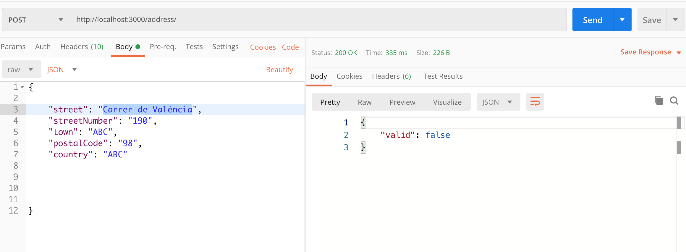
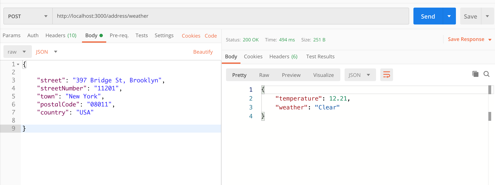
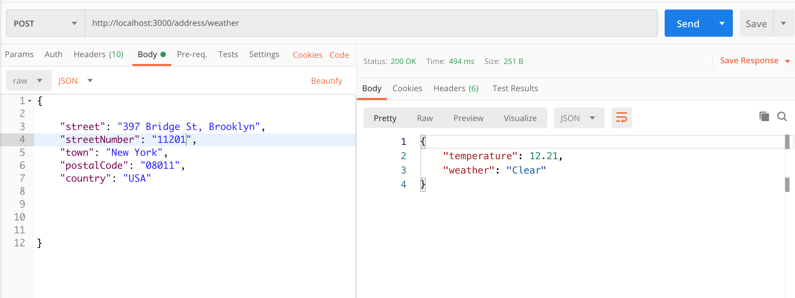
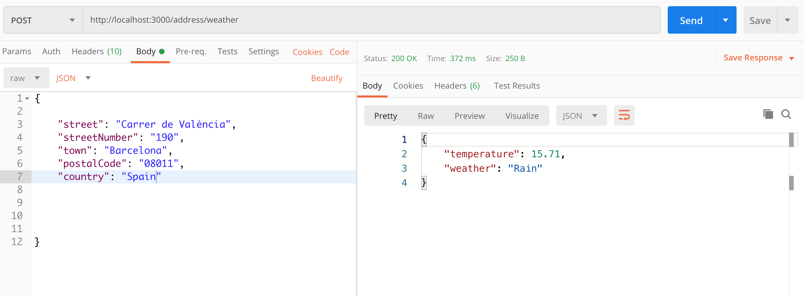

# Weather App - Express Application

Created an Express Application with the [Express application generator
](https://expressjs.com/en/starter/generator.html) with the **goal** to create a REST API Node.js project that can handle validations and retrieve the data only from the below mentioned APIs.

API's used:

- [Here Maps Geocoding API](https://developer.here.com/documentation/geocoder/dev_guide/topics/what-is.html)
- ​[Open Weather API](https://openweathermap.org/api)

The app consist of two different endpoints:

1. An endpoint ​that receives an address and validates it if it’s valid. This address must be in an object with the properties street, streetNumber, town, postalCode and country.

2. An endpoint ​that receives an address, validate it and checks the weather for the latitude/longitude of that address.

## How it works

**Endpoint 1** : the Here Maps API is being pinged with a body consisting of an object with the properties street, streetNumber, town, postalCode and country. If the address is correct the endpoint will respond with `{valid: true}` otherwise `{valid: false}`





**Endpoint 2** : the Here Maps API is being pinged with a body consisting of an object with the properties street, streetNumber, town, postalCode and country. If the address is correct the endpoint will return the latitude and longitude at that given address. This will be passed into the Open Weather API which ``returns in case all goes well the weather and temperature at the given address based on the latitude and longitude.





## How to use it

You could connect this to a Frontend maybe with React and create a weather web app based on specific location.

## Install

```
$ git clone https://github.com/stefi23/weather-app.git
$ cd weather-app
$ npm install
```
